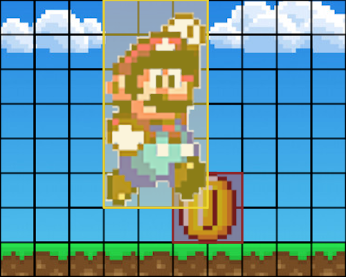
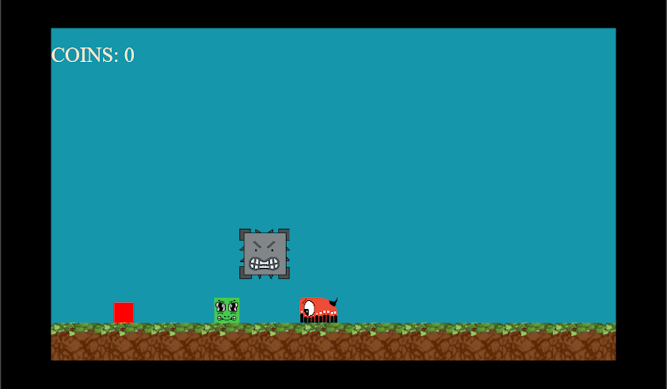
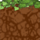
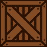
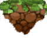
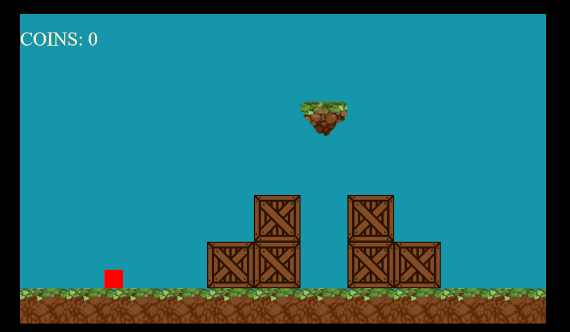
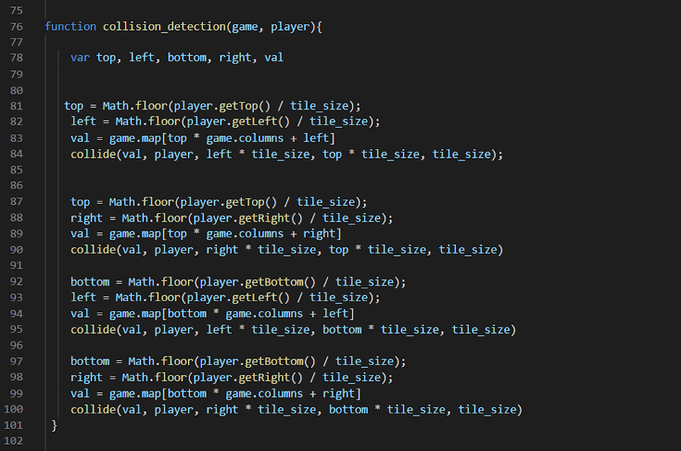
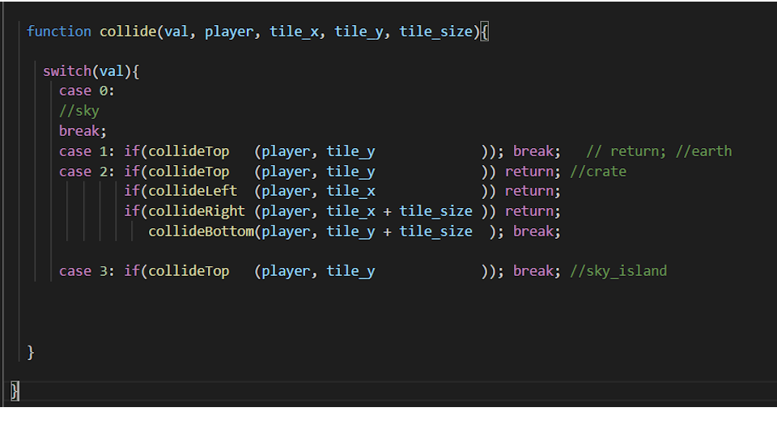
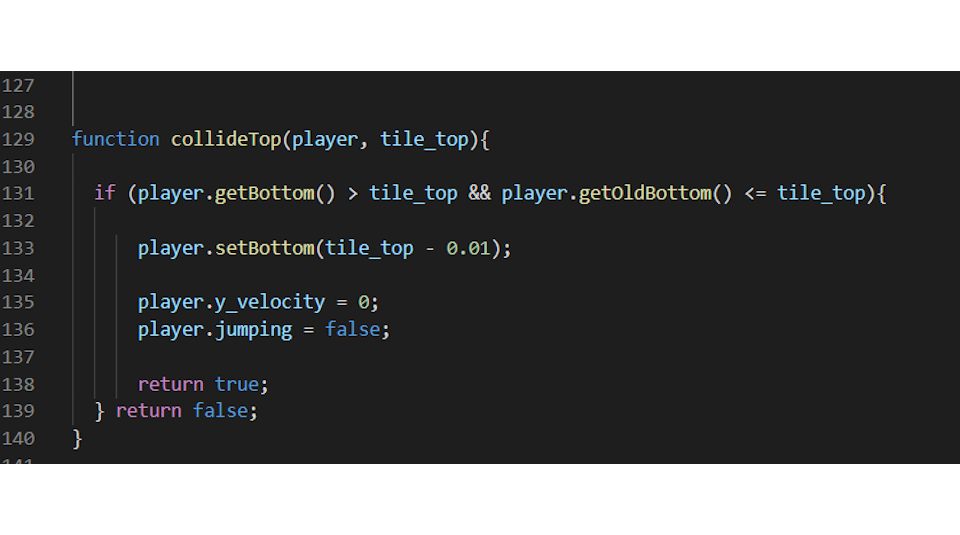

# **2D Collision Detection and Interacting Game Components**

I wanted to make a game that would operate and feel like Super Mario World out of JavaScript. The physics and movement of the characters on the screen in these games are simple and elegant. 
The most basic way to approach this type of 2d collision detection is to utilize a concept known as **Axis-aligned bounding box**. 

**Axis-aligned bounding box**, or **AABB**, detects if two non-rotational polygons are overlapping each other. Typically **AABB** algorithms run something like this:

We have two polygons:



We then compare X and Y positions along with width and height to see if they are overlapping.
```markdown
function aabb(a, b){
  return a.x < b.x + b.width
  && a.x + a.width > b.x
  && a.y < b.y + b.height 
  && a.y + a.height > b.y;
}
```

Let's plug in the real values for mario and his coin, represented by the yellow and red polygons...

```markdown
function aabb(yellow, red){
  return 120 < 280
  && 240 > 200
  && 0 < 280 
  && 240 > 200;
}
//collision detected!!!
```

 
This algorithm has a robust range of applications. It can be used to detect if your player is over a collectible item, touching a bad guy or at the door at the end of the game. Once a collision is detected depending on the game components involved there are many specific desired outcomes. If the player falls on top of a ledge it we want it to stop falling. If she hits a wall she can't pass through it. If the player hops on top of the bad guy, the bad guy dies. This is how I applied AABB collision detection to my project and got these types of interactions.


## **Game Components**

My project was a simple tile-based 2d platform game consisting of the player object, a 32 by 32 pixel red square named “Cubio”, three types of “baddies” and the tile map of the game’s world. 



### **Tiles**
The entire map is made up of just four tiles types. 80 by 80 pixels in dimension, each has it’s own numerical value and specified sets of rules that determine how the player interacts with them upon collision.

0: sky 


The player moves freely through this tile.

1: earth



If the player lands on top of the tile, the player’s vertical movement stops and it rests on top of the tile, otherwise it can go through this tile in every other direction.

2: crate



If the player collides with any side of this tile it’s position stays outside of this tile.

3: sky_island



If the player lands on top of the tile, the player’s vertical movement stops and it rests on top of the tile, otherwise it can go through this tile in every other direction.


### **Map**

Without going into too much detail here the tile map is represented by an array of tile types in their assigned column and row, such that the array:

```
const  DEFAULT_MAP = [ 0, 0, 0, 0, 0, 0, 0, 0, 0, 0, 0, 0, 
                       0, 0, 0, 0, 0, 0, 0, 0, 0, 0, 0, 0, 
                       0, 0, 0, 0, 0, 0, 0, 0, 0, 0, 0, 0, 
                       0, 0, 0, 0, 0, 0, 3, 0, 0, 0, 0, 0, 
                       0, 0, 0, 0, 0, 2, 0, 2, 0, 0, 0, 0, 
                       0, 0, 0, 0, 2, 2, 0, 2, 2, 0, 0, 0, 
                       1, 1, 1, 1, 1, 1, 1, 1, 1, 1, 1, 1  
                       ]
```

...appears as:



game loop was here


## **Interaction and Behavior**


 Whether its the sky or earth, my player is always colliding with at least one tile in every single frame so there is no need to run the aabb() function. My collision_detection() function first locates the position of each corner of the player. Then, it retrieves the type of tile that corner is colliding with. Then it passes in the tile’s type and the corner’s x and y position into the collide() function. 





The collide() function uses a switch statement to select the appropriate block of code to run depending on the tile type. As you can see type “0” (sky) has no effect and type “2” (crate) collides with all four sides. In case your are wondering why I’ve defined these points twice in collision_detection(), it’s because each time I call collide() it has the potential to move the player. So every point has to be redefined each time after I call collide(). 




In these different tile collide functions you can see the older position of the player is compared to the tile as well. This allows you to establish the direction the player is going. The function needs to know what direction the player is going in order to have the correct response. Otherwise if the player collided with the bottom of the crate tile, it’s top is now above the crate’s bottom. Then when we run collide() the collide_top() fires first and places the player on top of the tile. To the user it would appear as if the player went straight through the bottom of the crate and landed on top. This negative effect is known as “tunneling”. Therefore, establishing player direction gives us a better representation of whats happening. 

baddies collide was here


## **Efficiency**

Once all of you tiles, coins and baddies are interacting with you player correctly you’ll notice that running a collision test on every coin and every baddy at every cycle of you engine loop is very costly and unnecessary. This is where you separate the process of test for collision into two phases, broad and narrow.


### **Broad**

Create an array of near objects that may need to be tested. Here we are only checking the object’s x position when we iterate through entire list which is a lot less costly than running the entire collision test on each one.

### **Narrow**

Once a much smaller list of near objects is created we then iterate over each testing for collision and/or run appropriate blocks of code.


Collision detection is the mechanism that brings your game to life. Each step is easy to understand and can be re-imagined many different ways, but powerful in its effect. Happy coding!


